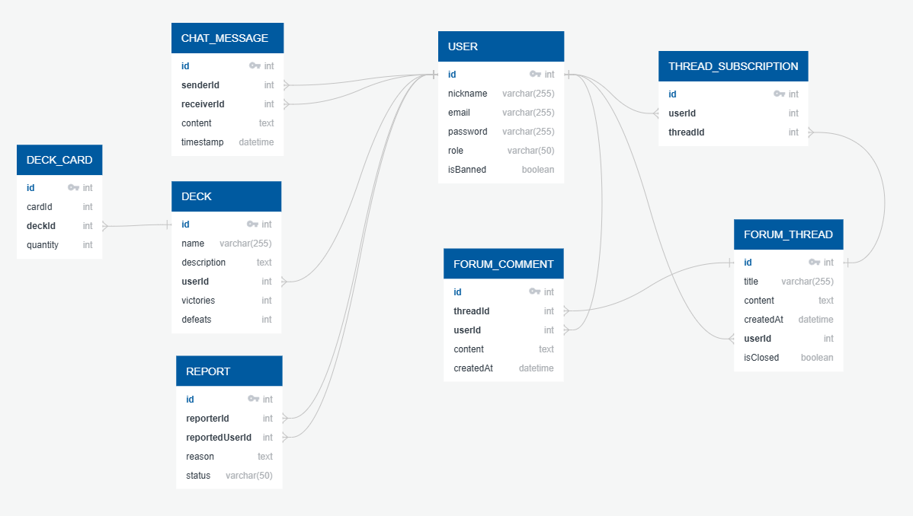

# MagicHub

## Índice
- [Autores del Proyecto](#autores-del-proyecto)
- [Descripción](#descripción)
- [Objetivos del Proyecto](#objetivos-del-proyecto)
- [Tecnologías Utilizadas](#tecnologías-utilizadas)
- [Esquema de la base de datos](#esquema-de-la-base-de-datos)
- [Tutorial de Uso](#tutorial-de-uso)
- [URLs de despliegue y descarga](#urls-de-despliegue-y-descarga)
- [Diseño de la Aplicación](#diseño-de-la-aplicación)
- [Presentación](#presentación)
- [Bitácora de Tareas](#bitácora-de-tareas)
- [Bibliografía](#bibliografía)
- [Vídeos](#vídeos)
- [Anteproyecto](#anteproyecto)

---

## Autores del Proyecto

- David Martín García  
- José Noé González Grelaud  

---

## Descripción

MagicHub es una aplicación web multiplataforma diseñada para unir a la comunidad de *Magic: The Gathering*, desde principiantes hasta expertos.

La aplicación ofrece a los usuarios que puedan intercambiar información a través de chats y foros, además de gestionar y mostrar sus mazos construidos. Dispone también de funcionalidades como la autenticación de usuarios, notificaciones en tiempo real y asesoría de una inteligencia artificial.

Se utilizará Ionic para tener una interfaz de usuario optimizada en dispositivos móviles, Material Design 3 en los componentes visuales y una arquitectura MVVM en el proyecto. 

En el servidor se utilizará un sistema de ficheros para almacenar los logs de los últimos 7 días. Cada día cambiará a un fichero diferente y se podrá tener un seguimiento de posibles errores o simplemente consultar diferentes tipos de datos, como por ejemplo qué usuarios se conectaron ese día a la aplicación.

En el cliente se empleará una persistencia de datos para almacenar opciones de configuración de la aplicación y datos del usuario.

---

## Objetivos del Proyecto

1. Crear un ecosistema para jugadores de *Magic: The Gathering* que fomente la colaboración y el aprendizaje.  
2. Facilitar la interacción social mediante chats y foros.  
3. Ofrecer análisis de cartas y recomendaciones mediante IA.  

---

## Tecnologías Utilizadas

- **Frontend:** Angular + Ionic + Capacitor  
- **Backend:** ASP.NET Core  
- **Base de datos:** MySQL

---

## Esquema de la base de datos

### Diagrama Entidad–Relación (ER)

---

## Tutorial de Uso

---

## URLs de despliegue y descarga

### Web
[Enlace](https://magic-hub-app.vercel.app/)

### Android (APK)
[Enlace](https://drive.google.com/drive/folders/1mJjBOEZnIKB-zrNw0YdbJ_z0uCPuiiyF?usp=sharing)

---

## Diseño de la Aplicación

### Figma
[Enlace](https://www.figma.com/design/9UIaWhamE4J6e4vrTp9jap/MAGICHUB-MOCKUP?node-id=0-1&t=RVZqIslaLqk6i7ja-1)

---

## Presentación

[Ver presentación del proyecto (PDF)](./MagicHub.pdf)

---

## Bitácora de Tareas

### David
- **12/04/2025**: Configuración inicial del proyecto y instalación de dependencias.
- **13/04/2025**: Login y Registro en el servidor.
- **16/04/2025**: Refrescar el token en el servidor.
- **17/04/2025**: Guardar los logs en ficheros en el servidor.
- **20/04/2025**: Crear entidades y conexión WebSocket.
- **23/04/2025**: Actualización del cliente para login, registro, conexión WebSocket y refresco de token.
- **24/04/2025**: Despliegue del servidor.
- **25/04/2025**: Login en funcionamiento.
- **26/04/2025**: Refresco de token y registro en funcionamiento; despliegue del cliente.
- **27/04/2025**: Búsqueda de cartas por nombre funcionando (servidor y cliente).
- **29/04/2025**: Obtener datos de una carta por ID funcionando (servidor y cliente).
- **11/05/2025**: Arreglos menores en el cliente.
- **12/05/2025**: Chat global funcionando en el servidor y en el cliente.
- **14/05/2025**: Implementación del historial de mensajes en el chat global.
- **16/05/2025**: Chat privado funcionando en servidor y cliente.
- **17/05/2025**: Buscador de usuarios, perfil del usuario y perfil de otro usuario en funcionamiento.
- **18/05/2025**: Sistema de reportes de usuarios funcionando en el servidor y cliente.
- **29/05/2025**: Perfil admin funcionando en el servidor y cliente.
- **31/05/2025**: Foro funcionando en el servidor.
- **01/06/2025**: Implementando la lógica del foro en el cliente.
- **04/06/2025**: Foro en funcionamiento en el cliente con notificaciones.
- **07/06/2025**: Chat de la IA funcionando en el servidor y cliente.
- **08/06/2025**: Análisis de cartas con la IA en el servidor y cliente.
- **09/06/2025**: Traduciendo componentes e implementando el modo oscuro.
- **10/06/2025**: Todos los componentes traducidos.
- **11/06/2025**: Compatibilidad con el idioma inglés para las funciones de la IA.
- **12/06/2025**: Últimos ajustes estéticos y presentación del proyecto.

### Noe
- **23/04/2025**: Creación del figma y primeros pasos de maquetación
- **24/04/2025**: Vistas de buscador de cartas, detalles de cartas, mazos, crear mazos completadas.
- **25/04/2025**: Resto de vistas terminadas.
- **27/04/2025**: Ajustes esteticos en el inicio, el login y el menu principal.
- **29/04/2025**: Ajustes esteticos en el menu principal y el registro más la creación de los componentes mazos y crear mazos con sus respectivos estilos.
- **16/05/2025**: Logica de los mazos en el backend.
- **1/06/2025**: Mazos completado.
- **2/06/2025 - 7/06/2025**: Mejora en la vista de busqueda de cartas(filtros, paginación, cargar cartas al entrar en la vista)
- **8/06/2025**: Flechas de navegación entre vistas.
- **9/06/2025**: Vistas para ver mazos de otros usuarios.
- **10/06/2025**: Menu desplegable completado + eliminar cartas de un mazo.
- **11/06/2025**: Vista de ajustes y vista de ver todos los mazos + ajustes estéticos
- **12/06/2025**: Cambios en los estilos de la aplicación(CSS) + creación del informe de la aplicación.

---

## Bibliografía

- [Documentación de Ionic](https://ionicframework.com/docs/components)
- [Documentación de Angular](https://angular.dev/overview)
- [Documentación de Capacitor](https://capacitorjs.com/docs)
- [Documentación de ASP.NET](https://learn.microsoft.com/es-es/aspnet/core/?view=aspnetcore-9.0)
- [Scryfall API – Magic: The Gathering](https://scryfall.com/docs/api)
- [Simple magic Api demo](https://www.youtube.com/watch?v=l50izjxnJtE)
- [HttpClient In .NET](https://www.youtube.com/watch?v=g-JGay_lnWI)
- [Generar archivos APK](https://code.tutsplus.com/es/how-to-generate-apk-and-signed-apk-files-in-android-studio--cms-37927t)
- [Documentación de la API de la IA](https://openrouter.ai/docs/quickstart)
- [Modelo de IA](https://openrouter.ai/deepseek/deepseek-r1-0528:free)
- [Guía de NGX-Translate por CodeAndWeb](https://www.codeandweb.com/babeledit/tutorials/how-to-translate-your-angular-app-with-ngx-translate)
- [Guía de NGX-Translate por DigitalOcean](https://www.digitalocean.com/community/tutorials/angular-ngx-translate)

---

## Vídeos

### Entrega del proyecto

[Enlace]()

---

### Revisión del proyecto

[Enlace](https://drive.google.com/file/d/1W9ygPesxZU1p28SSNWP7tGrXJTAct0H_/view?usp=sharing)

---

## Anteproyecto

[Enlace](https://big-mercury-2f2.notion.site/Anteproyecto-1c625e1380868064812cf17aef250f8b)
